# 1) RadCorr Instructions
## a) Input
### i) Datasets
#### (1) All data files should be placed in the following directory: CAnalyzer-master/example/data/
#### (2) Data files should be have the following format: nu xs staterr systerr
#### (3) Each data file should include data with same beam energy and scattering angle
### ii) Angle Acceptance File
#### (1) First 3 lines represent the polynomial coefficients for the stepwise acceptance function; 4th line tells the ranges of the stepwise functions
#### (2) 1st and 3rd lines have the following format: x^0 x^1 x^2 x^3 x^4
#### (3) 2nd line only has x^0 and x^1 coefficients
#### (4) 4th line has the following format: min1 max1(min2) max2(min3) max3 where min# is the minimum x for line # and max# is the maximum x for line #
#### (5) For flat acceptance, I had 1 for the x^0 coefficient on the 2nd line and 0 for every other coefficient in the first 3 lines; then have min2 and max2 be the range you want flat acceptance for
#### (6) x above represents the angle in degrees
### iii) Dataset Config
#### (1) I recommend the following naming convention for dataset config files: “data_sets_<theta>deg_<polarization>.conf” where theta is the scattering angle in degrees and polarization is “unpol”, “long”, or “trans”
#### (2) Each dataset config file should contain datasets with varying beam energies at the same scattering angle
#### (3) These dataset config files should be placed in the following directory: CAnalyzer-master/example/configs/
#### (4) Theta can be set in the Settings section
#### (5) The Data Folder and Angle Acceptance Folder can also be set in the Settings section, but I would keep them as ../data and ../cuts/tight respectively
#### (6) DataSet Section
##### (a) Set Beam Energy in MeV
##### (b) Radiation Length After should include Radiation Length Wall
##### (c) Data File should be name of / path to data file after in the /data directory (could organize to have angle subdirectories)
##### (d) Acceptance File should be created and placed in proper angle folder
##### (e) For no collimator set up, you should use the Collimator File coll_none.txt I have created
##### (f) I do not think Radiation Length Wall is used for rad_cor.C, only for elastic tail
##### (g) Model should be set for true if the dataset is being used for interpolation only; All datasets for which Model is not set to true will have radiative corrections calculated for it; This only applies to the radiate() function in rad_cor.C
### iv) Radcorr Config
#### (1) Most of the settings here are self-explanatory
#### (2) May want to set Extrapolation By Model to yes instead of no
#### (3) Can change integration settings if necessary, although the current settings should work just fine
### v) rad_cor.C Inputs
#### (1) The rad_corr() function
##### (a) No inputs are necessary, although the default dataset config file and output file are probably not what you want
##### (b) 1st parameter is the dataset config file name as a string; it should be of the form “configs/<dataset_config_filename>.conf”
##### (c) 2nd parameter is the output file name as a string; it should be of the form “output/<output_fiilename>.dat” I recommend the following output file naming convention: “output/radcor_out<Ebeam>_<theta>deg_<polarization>.dat” where Ebeam is the beam energy in MeV
#### (2) The radiate() function
##### (a) Again, no inputs are necessary, but I recommend using them for changing dataset config file name and output file name
##### (b) 1st parameter is the dataset config file name as a string (same as above)
##### (c) 2nd parameter is output file name as a string I recommend the following output file naming convention: “output/radiated_model_<theta>deg_<polarization>.dat”
## b) Output
### i) The rad_corr() function
#### (1) The output file of calling this function has labels for each column at the top of the file, but here is the output format: Ebeam nu sigrad sigborn staterr systerr where Ebeam is in MeV, nu is in MeV, sigrad is the input radiated cross section, sigborn is the result cross section
### ii) The radiate() function
#### (1) The output file of this function has labels at the top similar to the output for the rad_corr() function
#### (2) There are only two major differences between the output of rad_corr() and radiate():
##### (a) sigborn is instead the input cross section and sigrad is instead the output radiated cross section
##### (b) any points which were used as a model for interpolation in the dataset config file will have sigborn = sigrad
## c) Running the code
### i) Once you have your data input files, dataset config files, and acceptance files set up properly, named according to your convention, and placed in the appropriate directories, you can start to run the code
### ii) Note: I already have appropriate dataset config files set up, they can be found in rad_corr.C in the radiate_all() function
### iii) First you want to ensure that the code is compiled correctly by completing the following steps
#### (1) Enter the /CAnalyzer-master/ directory
#### (2) Type ‘make’ into the command line
#### (3) It should be clear if it compiled correctly, but to make sure you can type ‘make’ into the command line again and it should output the following: make: Nothing to be done for 'first'.
### iv) Then to load the ROOT macro, you should complete the following steps
##### (1) Enter the /CAnalyzer-master/example/ directory
##### (2) Type ‘root’ into the command line to start ROOT
##### (3) Type ‘.L rad_corr.C’ into ROOT to load the macro
### v) Type the following in ROOT to run the rad_cor() function: ‘rad_cor(“configs/<dataset_config_filename>.conf”,“output/<output_fiilename>.dat”)’
### vi) Type the following in ROOT to run the radiate() function: ‘radiate(“configs/<dataset_config_filename>.conf”,“output/<output_fiilename>.dat”)’
### vii) Additionally, to run the radiate() function on all a1n d2n kinematics (11, 18, 30deg) and polarizations (unpol, long, trans) I have implemented a function called radiate_all() which you can run to make it simpler
# 2) Model Input to Radiate
## a) Cross Section Generation
### i) Below are the equations I used for unpolarized cross section, longitudinally polarized cross section difference, and transversely polarized cross section difference using the unpolarized structure functions F1 and F2 and the polarized structure functions g1 and g2:
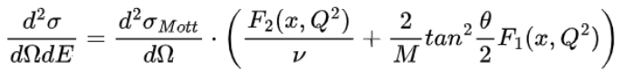
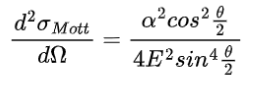

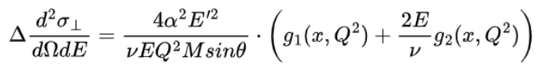
### ii) The unpolarized structure functions F1 and F2 are taken from the ‘strufunc_f1f221_dis6.f’ fortran file, which are from the F1F221 fits
### iii) The polarized structure functions g1 and g2 are also taken from the ‘strufunc_f1f221_dis6.f’ fortran file, and are generated using the following fits from Xiaochao’s thesis:
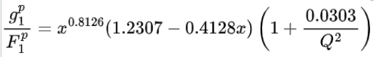
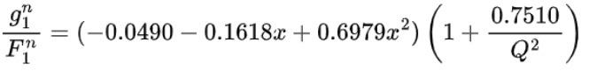
and then combining these proton and neutron structure functions in the following way:
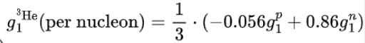
then g2 is calculated using a numerical integration using g1
## b) Running the code
### i) Enter the YoniCode_Retry_4Dave_2/Carter/ directory
### ii) Type ‘make’ into the command line to compile the code
### iii) To ensure compilation with no errors, type ‘make’ into the command line again and check that the output is: make: 'xs_gen_dis6' is up to date.
### iv) Type ‘./xs_gen_dis6’ to generate all the cross section data for theta values 11, 18, and 30
### v) The output files will be placed in the /Data directory with the following naming convention: ‘E<Ebeam>_<theta>deg<polarization>.dat’ where Ebeam is in MeV, theta is in degrees, and polarization is “” for unpolarized, “long” for longitudinal, and “trans” for transversal
### vi) The output files are also copied directly into the /CAnalyzer-master/example/data directory
## c) Radiating
### i) Follow the steps in the RadCorr Instructions section to run the radiate() function on this generated data
## d) Plotting
### i) Use the ‘plot_radcor3.py’ python file to make the plots
### ii) This should produce plots for all 3 theta values
### iii) Asymmetry Calculation
##### (1) Below is the calculation for the parallel Asymmetry
##### (2) Below is the calculation for the perpendicular Asymmetry
##### (3) These are calculated in the python plotting file from the results of the radiate() function
### iv) This will output plots of xs vs E’ and plots of Asymm vs x in the /Plots directory with the following naming conventions
##### (1) For xs plots: ‘<theta>deg_<polarization>.png’ where polarization is either ‘unpol’, ‘long’, or ‘trans’
##### (2) For Asymm plots: ‘<theta>deg_A<par/perp>.png’
### v) Note: the Asymmetry plots should have data points for theta = 11,18,30 degrees
# 3) Results Using Model Method
## a) Theta = 11 deg
### i) Parallel
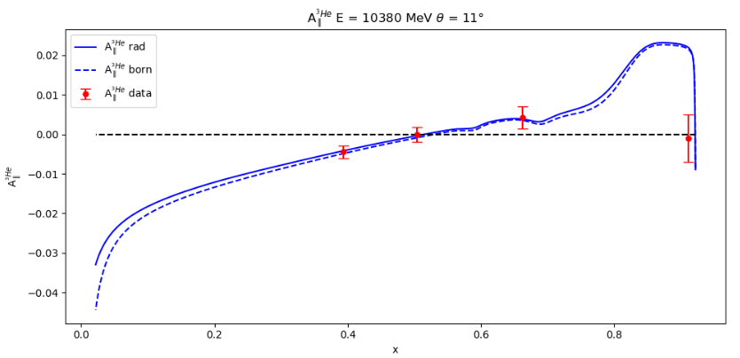
### ii) Perpendicular
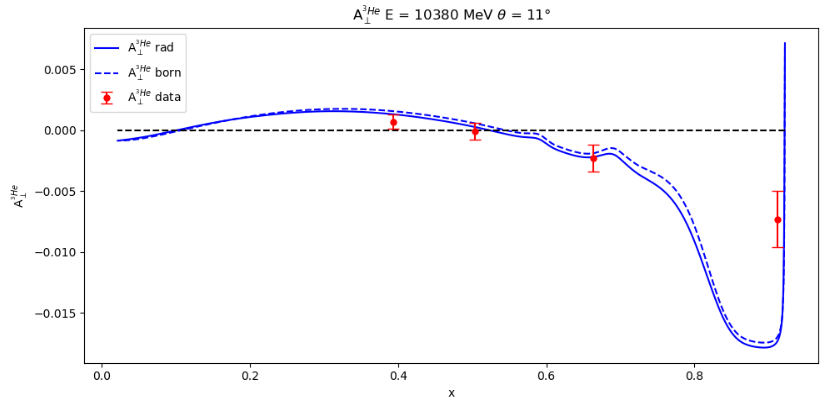
## b) Theta = 18 deg
### i) Parallel
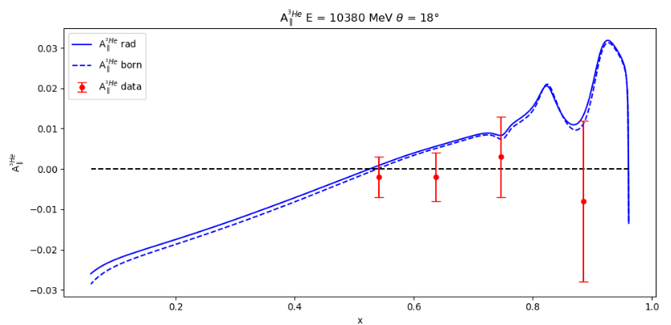
### ii) Perpendicular
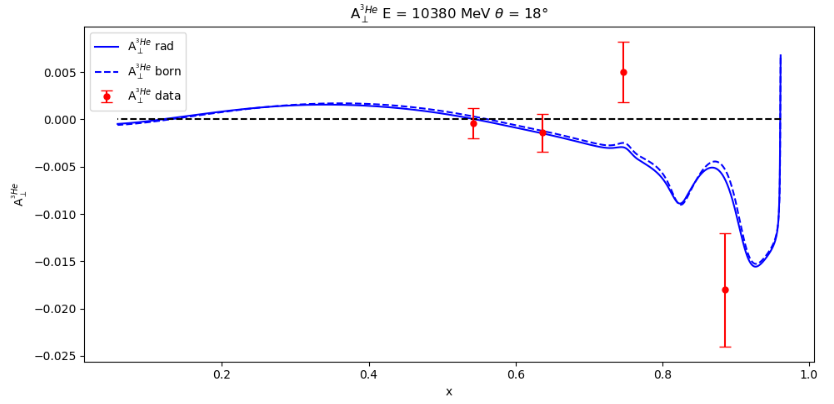
## c) Theta = 30 deg
### i) Parallel
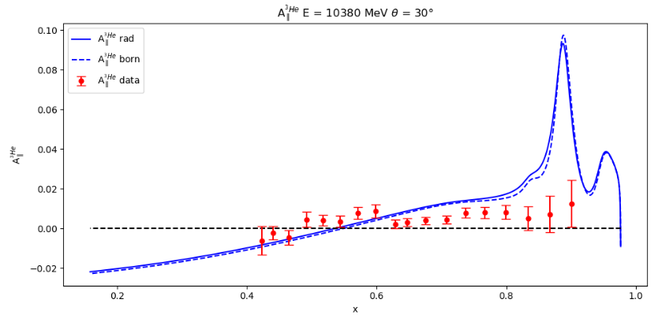
### ii) Perpendicular
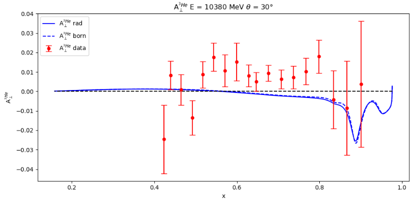
# 4) Other Model Input (JAM)
## a) Cross Section Generation
### i) The cross sections are calculated using the same equations as the first model input
### ii) Only difference is using bilinear interpolation on a structure function table seen in the file strufunc_jam.cpp
## b) Running the code
### i) Enter the YoniCode_Retry_4Dave_2/Carter/ directory
### ii) Type ‘make’ into the command line to compile the code
### iii) To ensure compilation with no errors, type ‘make’ into the command line again and check that the output is: make: 'xs_gen_jam' is up to date.
### iv) Type ‘./xs_gen_jam’ to generate all the cross section data for theta values 11, 18, and 30
### v) The output files will be placed in the /Data directory with the following naming convention: ‘E<Ebeam>_<theta>deg<polarization>.dat’ where Ebeam is in MeV, theta is in degrees, and polarization is “” for unpolarized, “long” for longitudinal, and “trans” for transversal
### vi) The output files are also copied directly into the /CAnalyzer-master/example/data directory
### vii) Note: This will overwrite the previous model input model files
## c) The only difference here is the structure functions used; using the radiate() function and the python plotting code should work exactly the same
